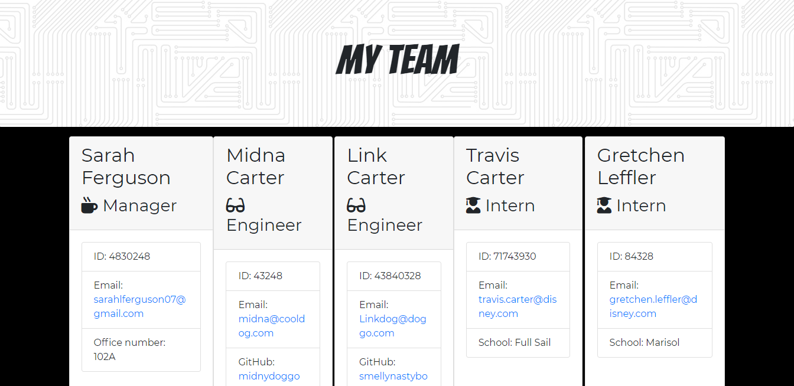
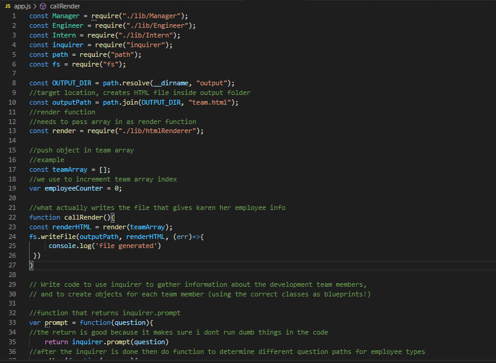
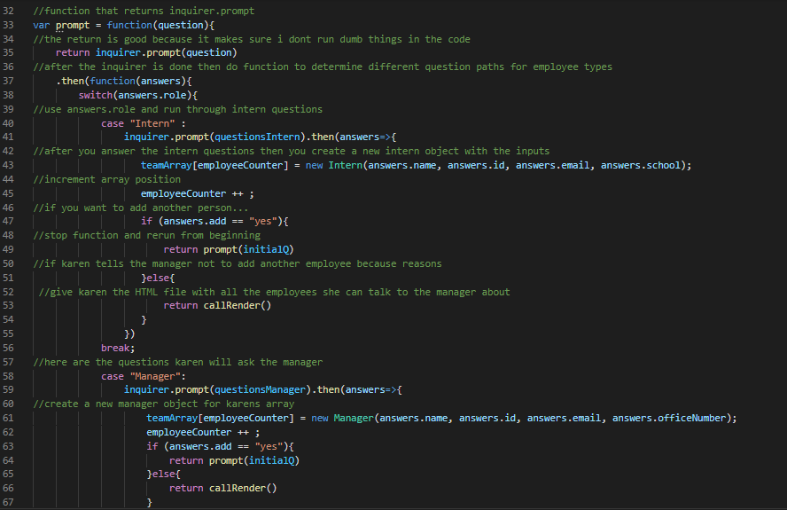
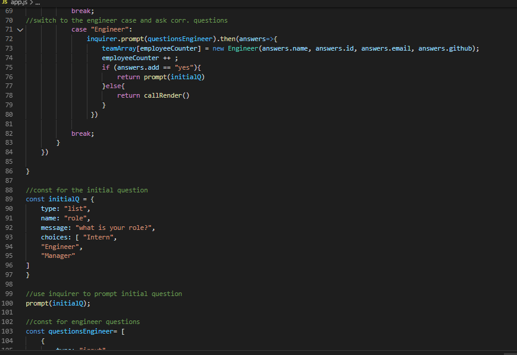
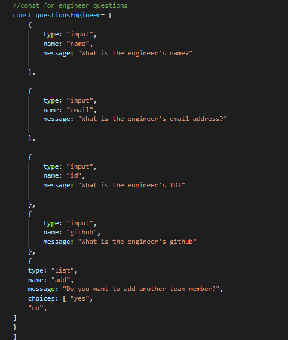
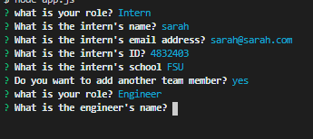

## Employee Summary Template Engine

Test run video: https://www.youtube.com/watch?v=l77WKiT7l50
 
Application run video: https://www.youtube.com/watch?v=oUuHxwOQvsU

## Description

This is a Node CLI that takes in information about employees and generates an HTML webpage that displays summaries for each person. The application will prompt the user for information about the team manager and then information about the team members. The user can input any number of team members, and they may be a mix of engineers and interns. This assignment must also pass all unit tests. When the user has completed building the team, the application will create an HTML file that displays a nicely formatted team roster based on the information provided by the user.

## Installation
  
 To install, run the command: npm i
  
  
## Usage 
  
The repo contains files used to generate a team roster for a potential manager. Included are an app.js which uses inquirer to ask a user questions, a series of Javascript files used to define the employee classes and HTML templates to render the employee info into. To use this project you must have node.js, install the dependencies and run "node app.js"

 ## License
  
This project is licensed under none.
  

## Contributions
  
No contributions

## Screenshots

 
Image of output site
 

 
app.js variables and initial code
 

 
inquirer question function 
 

 
end of function and beginning of questions
 

 
question array example
 

 
command line questions

